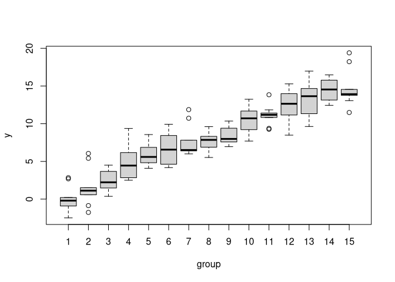

# TLDR

more groups make the test more stable and slightly more powerful (for
low samplesizes). However, be aware that this assumes homoscedaticity
(i.e. equal variance for all groups).

``` r
get_data <- function(n_per_group = 10, n_groups = 15) {
  grp <- as.factor(c(rep(1:n_groups, each = n_per_group)))
  data <- data.frame(group = grp, y = rnorm(n_groups * n_per_group, sd = 2) + as.numeric(grp))
}

# illustrate data
data <- get_data()
set.seed(123)
boxplot(y ~ group, data)
```



``` r
# Pairwise T-test using residuals of 2-15 groups
# plot results
pvals_mat <- replicate(20, { 
  data <- get_data()
  pvals <- sapply(2:15, function(i) {
    coefficients(summary(lm(y ~ group, data, subset = group %in% 1:i)))["group2", "Pr(>|t|)"]
  })
})

# plot each collumn of pvals_mat with matplot
matplot(pvals_mat, type = "l", xlab = "How Many Groups Considered +1")
```


``` r
# simulate power
# 2 groups vs 5 groups
n_sim <- 2000
results <- matrix(NA, nrow = n_sim, ncol = 2)
for (i in 1:n_sim) {
  data <- get_data(n_per_group = 3, n_groups = 5)
  results[i, 1] <- coefficients(summary(lm(y ~ group, data, subset = group %in% 1:2)))["group2", "Pr(>|t|)"]
  results[i, 2] <- coefficients(summary(lm(y ~ group, data, subset = group %in% 1:5)))["group2", "Pr(>|t|)"]
}
power <- apply(results < 0.05, 2, mean)
names(power) <- c("power using 2 groups,", " 5 groups")
power
```

    power using 2 groups,              5 groups 
                    0.074                 0.081 
