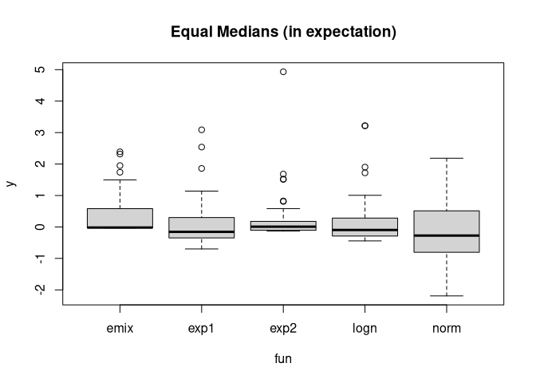

Define a list of laws (i.e. distributions) with `mean` and `sd`.

``` r
# functions 
n <- 40 # per group
laws <- list(
  norm = function(mean=0, sd=1) mean + sd *  rnorm(n, 0, 1),
  logn = function(mean=0, sd=1) mean + sd * (rlnorm(n, sdlog=1) - 1.65) / 1.95,
  exp1 = function(mean=0, sd=1) mean + sd * (rexp(n) - 1),
  exp2 = function(mean=0, sd=1) mean + sd * (rexp(n)^2 - 2) / 3.94,
  emix = function(mean=0, sd=1) mean + sd * (c(rep(0, n/2), rexp(n/2)) - 0.5) / 0.84
)
```

``` r
set.seed(123)
options(digits=3)

get_data_all_laws <- function(){
  dat <- lapply(names(laws), function(fname){
    f <- laws[[fname]]
    data.frame(y=f(), fun=fname)
  }) 
  dat <- do.call(rbind, dat)
  dat
}
boxplot(y ~ fun, get_data_all_laws(), main= "Laws illustrated")
```


verify mean and standard deviation

``` r
sapply(laws, function(f) mean(replicate(10000, mean(f(0, 1)))))
```

         norm      logn      exp1      exp2      emix 
     1.55e-03 -2.89e-03 -1.66e-03 -8.53e-05 -1.32e-03 

``` r
sapply(laws, function(f) mean(replicate(10000, mean(f(1, 2)))))
```

     norm  logn  exp1  exp2  emix 
    1.003 1.002 0.998 0.994 0.997 

``` r
sapply(laws, function(f) mean(replicate(10000,   sd(f(0, 1)))))
```

     norm  logn  exp1  exp2  emix 
    0.994 1.008 0.977 0.999 1.000 

``` r
sapply(laws, function(f) mean(replicate(10000,   sd(f(1, 2)))))
```

    norm logn exp1 exp2 emix 
    1.99 2.01 1.96 1.99 2.00 

Define the tests used

``` r
pval_t <- function(d) t.test(y ~ group,d)$p.value
pval_w <- function(d) coin::pvalue(coin::wilcox_test(y ~ group, d))
pval_m <- function(d) coin::pvalue(coin::median_test(y ~ group, d))
```

``` r
# retuns data with f1() for group "A" and f2(mean2, sd2) for group "B"
get_data <- function(f1, f2, mean2=0, sd2=1){
  d <- rbind(
    data.frame(
      y=f1(),
      group="A"
    ),
    data.frame(
      y=f2(mean2, sd2),
      group="B"
    ))
  d$group <- as.factor(d$group)
  d
}

# get power of tests
get_power <- function(f1, f2, nsim=1000, mean2=0, sd2=1) {
  data_list <- replicate(nsim, get_data(f1, f2, mean2=mean2, sd2=sd2), simplify = FALSE)
  c(t = mean(sapply(data_list, pval_t) < 0.05),
    w = mean(sapply(data_list, pval_w) < 0.05),
    m = mean(sapply(data_list, pval_m) < 0.05))
}

# get all combinations of functions
fun_comb <- expand.grid(names(laws), names(laws)) |> as.matrix()
rnames <- apply(fun_comb, 1, paste0, collapse="_")

sim <- function(nsim=1000, mean2=0, sd2=1) {
  fun_comb_list <- split(fun_comb, row(fun_comb))
  coverage <- parallel::mclapply(fun_comb_list, function(f_names){
    f1 <- laws[[f_names[1]]]
    f2 <- laws[[f_names[2]]]
    get_power(f1, f2, nsim=nsim, mean2=mean2, sd2=sd2)
  })
  coverage <- do.call(rbind, coverage) 
  rownames(coverage) <- rnames
  colnames(coverage) <- paste0(
    colnames(coverage), " ", as.character(mean2), " ", as.character(sd2))
  coverage |> as.data.frame()
}
```

# Simulation

``` r
nsim <- 500
```

``` r
set.seed(4321)
null <- sim(nsim=nsim)
```

``` r
set.seed(4321)
s_diff <- sim(nsim=nsim, sd2=2)
```

``` r
set.seed(4321)
s_difff <- sim(nsim=nsim, sd2=5)
```

``` r
set.seed(4321)
mu_diff <- sim(nsim=nsim, mean2 = 0.1)
```

``` r
set.seed(4321)
mu_difff <- sim(nsim=nsim, mean2 = 0.2)
```

``` r
results <- cbind(
  null,
  s_diff,
  s_difff,
  mu_diff,
  mu_difff
)
results * 100
```

|           | t 0 1 | w 0 1 | m 0 1 | t 0 2 | w 0 2 | m 0 2 | t 0 5 | w 0 5 | m 0 5 | t 0.1 1 | w 0.1 1 | m 0.1 1 | t 0.2 1 | w 0.2 1 | m 0.2 1 |
|:----------|------:|------:|------:|------:|------:|------:|------:|------:|------:|--------:|--------:|--------:|--------:|--------:|--------:|
| norm_norm |   4.2 |   4.4 |   3.6 |   4.4 |   4.6 |   5.0 |   7.0 |  10.6 |  10.6 |     8.4 |     7.6 |     4.6 |    14.4 |    12.4 |     8.4 |
| logn_norm |   8.0 |  12.6 |  33.6 |   4.2 |   8.0 |  16.4 |   4.8 |   9.0 |  14.6 |    12.8 |    25.4 |    45.6 |    21.0 |    41.4 |    59.8 |
| exp1_norm |   5.8 |   9.8 |  21.4 |   3.8 |   5.6 |  13.6 |   2.6 |   6.6 |  11.6 |     8.6 |    17.4 |    29.4 |    17.8 |    32.2 |    45.8 |
| exp2_norm |   5.6 |  15.4 |  46.8 |   5.6 |  11.4 |  26.0 |   3.4 |  10.6 |  16.2 |    11.4 |    27.2 |    63.2 |    21.6 |    46.4 |    79.6 |
| emix_norm |   3.8 |  10.2 |  46.4 |   5.6 |   9.6 |  25.4 |   4.8 |   7.8 |  11.2 |    10.0 |    23.8 |    61.0 |    15.6 |    42.4 |    80.4 |
| norm_logn |   5.2 |  14.2 |  31.0 |   7.8 |  41.0 |  54.0 |   7.4 |  77.0 |  76.4 |     4.0 |     4.8 |    15.8 |    12.0 |     7.8 |     9.0 |
| logn_logn |   5.4 |   7.8 |   5.8 |   7.6 |  56.8 |  32.6 |  10.6 |  77.6 |  70.2 |     6.8 |    17.4 |     8.4 |    14.0 |    51.4 |    25.8 |
| exp1_logn |   2.8 |   6.0 |   4.8 |   8.4 |  50.4 |  28.0 |  10.8 |  77.2 |  64.8 |     6.2 |    20.2 |     7.8 |    14.4 |    41.6 |    18.6 |
| exp2_logn |   4.4 |   7.6 |   7.8 |   5.8 |  58.8 |  33.8 |  11.8 |  80.8 |  73.2 |     8.8 |     9.8 |    23.4 |    17.4 |    52.0 |    54.0 |
| emix_logn |   2.6 |   4.4 |  10.0 |   5.4 |  55.0 |   0.8 |  11.8 |  76.0 |  17.0 |     3.8 |    35.0 |    31.0 |    11.6 |    92.8 |    56.6 |
| norm_exp1 |   3.8 |   9.4 |  17.6 |   6.0 |  29.6 |  34.4 |   8.2 |  49.6 |  51.2 |     5.6 |     6.2 |    11.6 |    10.8 |     7.2 |     5.8 |
| logn_exp1 |   5.0 |   7.8 |   5.0 |   4.8 |  33.0 |  17.8 |   6.8 |  51.0 |  44.2 |    10.8 |     6.6 |     9.0 |    17.8 |    23.2 |    18.6 |
| exp1_exp1 |   4.4 |   4.6 |   4.8 |   5.6 |  30.0 |  14.8 |   7.0 |  48.4 |  38.6 |     7.6 |    10.2 |     8.0 |    12.6 |    28.2 |    13.0 |
| exp2_exp1 |   5.2 |  11.2 |   9.2 |   4.6 |  33.8 |  18.6 |   6.6 |  49.0 |  44.4 |     9.8 |     6.0 |    20.2 |    20.8 |    21.0 |    44.6 |
| emix_exp1 |   2.8 |   3.8 |  10.8 |   4.8 |  34.2 |   1.0 |   6.6 |  50.4 |   5.4 |     4.6 |     7.0 |    20.0 |    12.2 |    29.2 |    46.2 |
| norm_exp2 |   5.2 |  15.4 |  48.0 |   7.8 |  51.0 |  80.6 |  14.6 |  95.0 |  94.4 |     3.6 |     8.4 |    29.4 |     9.2 |     7.2 |    17.2 |
| logn_exp2 |   2.8 |   9.0 |   6.8 |   7.6 |  86.2 |  67.8 |  14.8 |  97.2 |  94.6 |     6.2 |    38.2 |    10.6 |    17.6 |    69.4 |    27.4 |
| exp1_exp2 |   4.4 |  10.4 |   7.6 |   8.6 |  70.4 |  57.2 |  14.2 |  97.4 |  93.0 |     6.2 |    24.6 |     7.2 |    12.8 |    47.2 |    16.2 |
| exp2_exp2 |   4.2 |   5.6 |   5.0 |   9.4 |  91.0 |  70.8 |  11.0 |  94.8 |  92.2 |     5.8 |    67.8 |    23.2 |    12.4 |    91.0 |    59.6 |
| emix_exp2 |   2.0 |  64.8 |   9.0 |   9.0 |  87.0 |   7.4 |  14.4 |  95.4 |  48.6 |     3.6 |    85.2 |    35.8 |     9.8 |    96.6 |    61.0 |
| norm_emix |   3.2 |  10.6 |  47.2 |   2.4 |  49.6 |  77.0 |   4.0 |  91.4 |  90.4 |     3.6 |     6.6 |    32.0 |     9.6 |     4.0 |    18.2 |
| logn_emix |   1.8 |   2.4 |   9.4 |   3.6 |  87.0 |  61.8 |   4.0 |  90.4 |  86.0 |     8.2 |     9.0 |     2.2 |    15.4 |    43.6 |     0.4 |
| exp1_emix |   3.0 |   5.0 |  10.8 |   2.2 |  85.8 |  53.4 |   4.4 |  92.2 |  87.4 |     3.2 |    14.2 |     4.2 |    11.4 |    35.0 |     1.0 |
| exp2_emix |   1.2 |  62.0 |   9.8 |   2.4 |  87.0 |  65.8 |   4.2 |  91.2 |  88.8 |     5.6 |     1.0 |     0.8 |    18.4 |    71.6 |     0.0 |
| emix_emix |   1.2 |   0.0 |   0.0 |   2.8 |  89.2 |   2.0 |   3.8 |  91.6 |  20.2 |     2.4 |    82.4 |     0.0 |    10.0 |    94.8 |     0.2 |

## Confidence intervals of ratios

``` r
prop <- function(ratio, nsim){
  confint_ <- prop.test(round(ratio*nsim), nsim)$conf.int[1:2]
  names(confint_) <- c("lower", "upper")
   c( 
    ratio= ratio,
    confint_
)}
sapply(c(0:4/40, 3:10/20), prop, nsim) |> as.data.frame() * 100
```

|       |   V1 |   V2 |   V3 |   V4 |    V5 |   V6 |   V7 |   V8 |   V9 |  V10 |  V11 |  V12 |  V13 |
|:------|-----:|-----:|-----:|-----:|------:|-----:|-----:|-----:|-----:|-----:|-----:|-----:|-----:|
| ratio | 0.00 | 2.50 | 5.00 |  7.5 | 10.00 | 15.0 | 20.0 | 25.0 | 30.0 | 35.0 | 40.0 | 45.0 | 50.0 |
| lower | 0.00 | 1.30 | 3.33 |  5.5 |  7.58 | 12.0 | 16.6 | 21.3 | 26.1 | 30.9 | 35.7 | 40.6 | 45.6 |
| upper | 0.95 | 4.27 | 7.39 | 10.4 | 13.05 | 18.5 | 23.8 | 29.1 | 34.3 | 39.4 | 44.5 | 49.5 | 54.4 |

this gives an idea of the uncertainty of a ratio given 500 simulations

# redo analysis but with groupwise equal medians

Define a list of laws (i.e. distributions) with `median` and `sd`

``` r
# functions 
n <- 40 # per group
# mean == to keep notation consistent
laws <- list(
  norm = function(mean=0, sd=1) mean + sd *  rnorm(n, 0, 1)
  ,logn = function(mean=0, sd=1) mean + sd * (rlnorm(n, sdlog=1) - 1.02) / 1.95
  ,exp1 = function(mean=0, sd=1) mean + sd * (rexp(n) - 0.706)
  ,exp2 = function(mean=0, sd=1) mean + sd * (rexp(n)^2 - 0.523) / 3.94
  ,emix = function(mean=0, sd=1) mean + sd * (c(rep(0, n/2), rexp(n/2)) -0.025) / 0.84
)
```

verify **median** and standard deviation

``` r
sapply(laws, function(f) mean(replicate(10000, median(f(0, 1)))))
```

         norm      logn      exp1      exp2      emix 
    -0.000142 -0.000216  0.002144  0.000204  0.000246 

``` r
sapply(laws, function(f) mean(replicate(10000, median(f(1, 2)))))
```

     norm  logn  exp1  exp2  emix 
    1.000 1.001 0.998 1.000 0.999 

``` r
sapply(laws, function(f) mean(replicate(10000,     sd(f(0, 1)))))
```

     norm  logn  exp1  exp2  emix 
    0.996 1.006 0.978 1.010 1.003 

``` r
sapply(laws, function(f) mean(replicate(10000,     sd(f(1, 2)))))
```

    norm logn exp1 exp2 emix 
    1.99 2.00 1.95 1.99 2.01 

``` r
boxplot(y ~ fun, get_data_all_laws(), main= "Equal Medians (in expectation)")
```



``` r
set.seed(4321)
null_median <- sim(nsim=nsim)
```

``` r
set.seed(4321)
s_diff_median <- sim(nsim=nsim, sd2=2)
```

``` r
set.seed(4321)
s_difff_median <- sim(nsim=nsim, sd2=5)
```

``` r
set.seed(4321)
mu_diff_median <- sim(nsim=nsim, mean2 = 0.1)
```

``` r
set.seed(4321)
mu_difff_median <- sim(nsim=nsim, mean2 = 0.2)
```

``` r
results_median <- cbind(
  null_median,
  s_diff_median,
  s_difff_median,
  mu_diff_median,
  mu_difff_median
)  
results_median * 100
```

|           | t 0 1 | w 0 1 | m 0 1 | t 0 2 | w 0 2 | m 0 2 | t 0 5 | w 0 5 | m 0 5 | t 0.1 1 | w 0.1 1 | m 0.1 1 | t 0.2 1 | w 0.2 1 | m 0.2 1 |
|:----------|------:|------:|------:|------:|------:|------:|------:|------:|------:|--------:|--------:|--------:|--------:|--------:|--------:|
| norm_norm |   4.4 |   4.0 |   3.6 |   4.8 |   5.6 |   6.0 |   3.8 |   8.4 |   9.4 |     7.8 |     6.6 |     7.0 |    14.8 |    15.2 |    10.2 |
| logn_norm |  22.0 |  13.0 |   4.6 |  13.4 |  12.6 |   7.0 |   7.6 |   9.8 |  10.2 |    13.2 |     8.0 |     7.2 |     6.2 |     5.8 |    16.6 |
| exp1_norm |  20.8 |  10.6 |   3.4 |  12.6 |  11.6 |   6.0 |   5.4 |   8.2 |   9.4 |    11.8 |     6.4 |     6.0 |     7.8 |     7.2 |    12.2 |
| exp2_norm |  36.0 |  23.6 |   7.6 |  16.6 |  16.0 |  12.0 |   7.8 |  15.2 |  13.0 |    19.0 |    11.4 |     8.8 |     7.2 |     5.6 |    18.6 |
| emix_norm |  79.6 |  58.2 |   0.8 |  31.6 |  29.2 |   4.2 |  13.0 |  18.4 |   6.4 |    50.2 |    29.8 |     1.4 |    32.2 |    17.4 |     6.2 |
| norm_logn |  19.0 |  11.2 |   6.6 |  36.0 |  12.8 |   5.2 |  47.8 |   9.4 |   6.8 |    45.2 |    32.2 |     7.0 |    61.4 |    48.8 |    14.6 |
| logn_logn |   3.8 |   5.8 |   5.4 |   6.6 |   7.8 |   4.0 |  24.4 |  11.4 |   8.6 |     6.0 |    15.8 |     8.8 |    18.6 |    54.4 |    29.4 |
| exp1_logn |   3.4 |   8.6 |   5.2 |   9.2 |   5.6 |   5.0 |  23.8 |   9.2 |   6.8 |     6.8 |    23.6 |     7.6 |    13.8 |    47.4 |    18.8 |
| exp2_logn |   4.6 |  21.6 |   6.4 |   6.2 |  19.4 |   8.6 |  22.4 |  15.6 |  12.4 |     5.2 |     5.8 |    14.6 |    11.8 |    26.4 |    38.6 |
| emix_logn |  22.2 |  65.4 |   0.6 |   5.2 |  39.8 |   1.2 |  12.8 |  18.8 |   3.0 |     8.6 |    22.2 |     0.4 |     3.8 |     3.4 |     8.2 |
| norm_exp1 |  24.8 |  13.0 |   4.2 |  32.6 |   9.2 |   5.4 |  39.8 |   7.4 |   9.0 |    44.2 |    25.8 |     5.8 |    57.2 |    43.6 |     8.8 |
| logn_exp1 |   3.0 |   7.4 |   5.4 |   8.4 |  12.8 |   8.0 |  23.4 |  12.6 |  12.2 |     8.8 |     7.6 |     9.6 |    16.8 |    18.4 |    18.0 |
| exp1_exp1 |   5.2 |   5.8 |   5.8 |   9.0 |   8.8 |   6.8 |  24.4 |   9.6 |  10.8 |     8.4 |    10.2 |     6.8 |    13.6 |    26.4 |    11.8 |
| exp2_exp1 |   3.8 |  17.6 |   6.6 |   6.8 |  20.2 |  10.6 |  23.4 |  10.0 |  11.8 |     4.4 |     8.4 |     9.6 |     9.2 |     5.2 |    19.2 |
| emix_exp1 |  18.6 |  53.4 |   0.6 |   5.0 |  32.2 |   2.2 |  15.2 |  15.4 |   5.0 |     9.4 |    28.8 |     2.2 |     4.0 |    11.4 |     5.2 |
| norm_exp2 |  34.0 |  23.6 |   7.4 |  59.4 |  35.4 |   3.6 |  73.6 |  30.0 |   6.6 |    54.6 |    43.8 |    11.8 |    72.2 |    58.0 |    21.4 |
| logn_exp2 |   3.4 |  25.4 |   6.2 |  15.4 |  13.2 |   3.6 |  45.2 |   8.8 |   8.6 |     9.8 |    55.6 |    18.2 |    23.0 |    81.4 |    47.4 |
| exp1_exp2 |   6.0 |  21.8 |   6.8 |  13.8 |  25.0 |   4.0 |  45.2 |   5.8 |   4.4 |     8.6 |    47.4 |    15.6 |    23.2 |    66.6 |    29.2 |
| exp2_exp2 |   3.0 |   5.2 |   4.4 |   8.6 |  17.4 |   6.8 |  40.2 |  14.4 |  10.8 |     5.8 |    62.0 |    22.2 |    15.0 |    92.4 |    66.4 |
| emix_exp2 |  17.4 |  61.0 |   0.0 |   3.8 |  51.6 |   0.4 |  21.2 |  29.2 |   1.4 |     5.4 |     6.8 |     1.8 |     1.6 |    64.2 |    11.4 |
| norm_emix |  75.0 |  56.6 |   0.8 |  97.6 |  78.6 |   0.2 | 100.0 |  89.6 |   0.0 |    89.2 |    74.2 |     1.0 |    97.0 |    88.8 |     2.6 |
| logn_emix |  23.8 |  62.8 |   0.2 |  65.8 |  74.6 |   0.0 |  98.8 |  70.4 |   0.0 |    32.6 |    83.8 |     3.8 |    58.0 |    97.0 |     8.4 |
| exp1_emix |  24.4 |  57.0 |   0.2 |  72.2 |  72.4 |   0.2 |  99.4 |  83.2 |   0.0 |    34.0 |    72.4 |     1.6 |    55.8 |    87.8 |     4.6 |
| exp2_emix |  17.0 |  64.4 |   0.2 |  58.4 |  66.2 |   0.0 |  96.6 |   0.0 |   0.0 |    31.4 |    93.6 |     6.2 |    47.0 |    99.0 |    21.4 |
| emix_emix |   1.4 |   0.0 |   0.0 |  25.6 |   6.0 |   0.0 |  92.2 |   0.2 |   0.0 |     3.0 |    85.2 |     0.0 |    11.4 |    94.4 |     0.4 |
