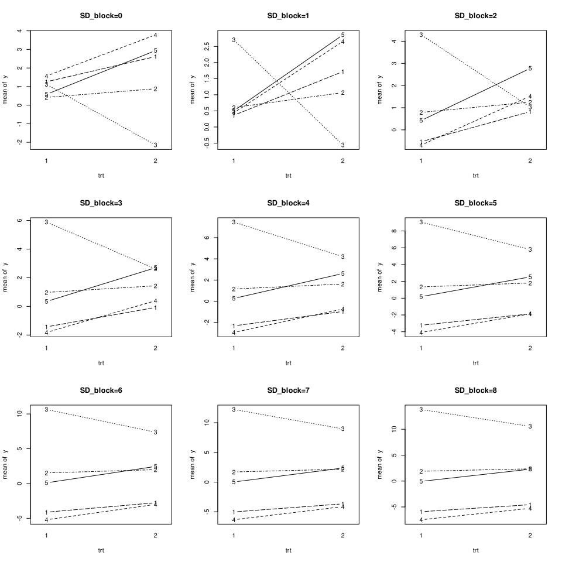

We study the classical setup of a randomized complete block design with
2 treatments, 2 replications per block and 5 blocks. We vary the
variance of the block effect and study how the p-values of the treatment
effect change.

$$
% equatiomatic::extract_eq(fit)
\begin{aligned}
  \operatorname{y}_{i}  &\sim N \left(\alpha_{block(i)} + \beta_{trt(i)}, \sigma^2 \right) \\
    \alpha_{j}  &\sim N \left(\mu_{\alpha_{j}}, {\sigma_{\alpha_{j}}}^2 \right)
    \text{, for block j = 1,} \dots \text{,5}\\
    % contr sum for \beta_{trt(i)}:
    \beta_{1}  &= - \beta_{2}  \quad \text{(contr.sum)}
\end{aligned}
$$

### TLDR

The p-values of the treatment effect are not influenced by the variance
of the block effect in our example.

## Simulate Data

``` r
library(ggplot2)
library(lmerTest)

options(contrasts = c("contr.sum", "contr.poly"))
```

``` r
# simulate data for a linear mixed model
# a randomized complete block design with 3 treatments, nblock blocks, nrep replicates per block
# an observation error with standard deviation SD_noise and a block effect with standard deviation SD_block
# a treatment effect with standard deviation SD_trt
get_data <- function(nblock=5, nrep=2, SD_noise=3, SD_block=1, SD_trt=0) {
  data <- expand.grid(
    nrep = 1:nrep,
    trt = as.factor(1:2),
    block = as.factor(1:nblock)
  )
  block_effect <- SD_block * rnorm(nblock)[data$block]
  noise <- SD_noise * rnorm(nrow(data))
  trt_effect <- SD_trt * rnorm(nrow(data))[data$trt]
  data$y <- trt_effect + block_effect + noise
  data
}
```

## Plot Function

``` r
# function that makes an interactions plot
plot_interactions <- function(data, ...) {
  with(data,
  interaction.plot(
      x.factor = trt,
      trace.factor = block,
      response = y,
      type = "b",
      legend = FALSE,
      ...
    )
  )
}
```

## Perform Analysis

1.  Get Data that only differs with respect to SD_block (increasing)  
2.  Plot the data for each SD_block
3.  Fit a model with lmer and lm for each SD_block  
4.  inspect how the estimates and standard errors of the treatmenteffect
    change with increasing SD_block

``` r
SD_blocks <- 0:8
fits <- vector("list", length(SD_blocks)*2)
dim(fits) <- c(length(SD_blocks), 2)
dimnames(fits) <- list(paste0("SD_block=",as.character(SD_blocks)), c("lmer", "lm"))

par(mfrow=c(3,3))
for(i in seq_along(SD_blocks)){
  SD_block <- SD_blocks[i]

  set.seed(2)
  data <- get_data(SD_block=SD_block)
  plot_interactions(data, main=paste0("SD_block=", SD_block))
  
  # lmer
  fits[[i,1]] <- lmer(y ~ trt + (1|block), data=data)
  
  # lm
  fits[[i,2]] <- lm(y ~ trt + block, data=data)
}; par(mfrow=c(1,1))
```

    boundary (singular) fit: see help('isSingular')
    boundary (singular) fit: see help('isSingular')
    boundary (singular) fit: see help('isSingular')



``` r
# apply a function to each element of a list-array
# preserving the dimensions and dimnames
elementwise_apply <- function(L, f){
  L_applied <- lapply(L, f)
  dim(L_applied) <- dim(L)
  dimnames(L_applied) <- dimnames(L)
  L_applied
}

summary_coef_trt1 <- elementwise_apply(fits, function(fit) coef(summary(fit))["trt1",])
```

## Results

Illustration: How `summary_coef_trt1` looks like:

``` r
summary_coef_trt1["SD_block=5",]
```

    $lmer
      Estimate Std. Error         df    t value   Pr(>|t|) 
      -0.31258    0.85616   14.00000   -0.36510    0.72049 

    $lm
      Estimate Std. Error    t value   Pr(>|t|) 
      -0.31258    0.85616   -0.36510    0.72049 

``` r
# estimate
elementwise_apply(summary_coef_trt1, function(coef) coef[1])
```

               lmer     lm      
    SD_block=0 -0.31258 -0.31258
    SD_block=1 -0.31258 -0.31258
    SD_block=2 -0.31258 -0.31258
    SD_block=3 -0.31258 -0.31258
    SD_block=4 -0.31258 -0.31258
    SD_block=5 -0.31258 -0.31258
    SD_block=6 -0.31258 -0.31258
    SD_block=7 -0.31258 -0.31258
    SD_block=8 -0.31258 -0.31258

``` r
# standard error
elementwise_apply(summary_coef_trt1, function(coef) coef[2])
```

               lmer    lm     
    SD_block=0 0.79971 0.85616
    SD_block=1 0.75889 0.85616
    SD_block=2 0.78422 0.85616
    SD_block=3 0.85616 0.85616
    SD_block=4 0.85616 0.85616
    SD_block=5 0.85616 0.85616
    SD_block=6 0.85616 0.85616
    SD_block=7 0.85616 0.85616
    SD_block=8 0.85616 0.85616

``` r
# p-value
elementwise_apply(summary_coef_trt1, function(coef) coef[length(coef)])
```

               lmer    lm     
    SD_block=0 0.70048 0.72049
    SD_block=1 0.68528 0.72049
    SD_block=2 0.69488 0.72049
    SD_block=3 0.72049 0.72049
    SD_block=4 0.72049 0.72049
    SD_block=5 0.72049 0.72049
    SD_block=6 0.72049 0.72049
    SD_block=7 0.72049 0.72049
    SD_block=8 0.72049 0.72049

``` r
# random effect variance
sapply(fits[,1], function(fit) VarCorr(fit)$block[1]) |> sqrt() |> signif(2) 
```

    SD_block=0 SD_block=1 SD_block=2 SD_block=3 SD_block=4 SD_block=5 SD_block=6 
          0.00       0.00       0.00       0.73       2.50       3.70       4.90 
    SD_block=7 SD_block=8 
          6.00       7.20 
