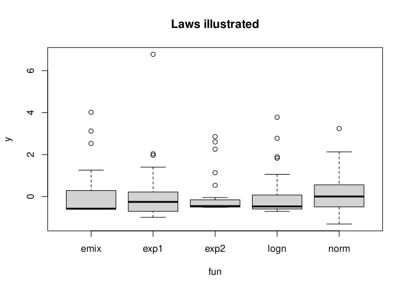
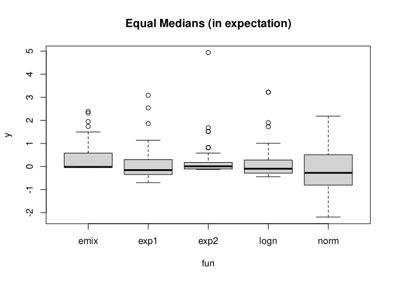

Define a list of laws (i.e., distributions) with `mean` and `sd`.

``` r
nsim <- 200
library(coin)
```

    Loading required package: survival

``` r
# functions 
n <- 40 # per group
laws <- list(
  norm = function(mean=0, sd=1) mean + sd *  rnorm(n, 0, 1),
  logn = function(mean=0, sd=1) mean + sd * (rlnorm(n, sdlog=1) - 1.65) / 1.95,
  exp1 = function(mean=0, sd=1) mean + sd * (rexp(n) - 1),
  exp2 = function(mean=0, sd=1) mean + sd * (rexp(n)^2 - 2) / 3.94,
  emix = function(mean=0, sd=1) mean + sd * (c(rep(0, n/2), rexp(n/2)) - 0.5) / 0.84
)
```

``` r
set.seed(123)
options(digits=3)

get_data_all_laws <- function(){
  dat <- lapply(names(laws), function(fname){
    f <- laws[[fname]]
    data.frame(y=f(), fun=fname)
  }) 
  dat <- do.call(rbind, dat)
  dat
}
boxplot(y ~ fun, get_data_all_laws(), main= "Laws illustrated")
```



Verify mean and standard deviation

``` r
sapply(laws, function(f) mean(replicate(10000, mean(f(0, 1)))))
```

         norm      logn      exp1      exp2      emix 
     1.55e-03 -2.89e-03 -1.66e-03 -8.53e-05 -1.32e-03 

``` r
sapply(laws, function(f) mean(replicate(10000, mean(f(1, 2)))))
```

     norm  logn  exp1  exp2  emix 
    1.003 1.002 0.998 0.994 0.997 

``` r
sapply(laws, function(f) mean(replicate(10000,   sd(f(0, 1)))))
```

     norm  logn  exp1  exp2  emix 
    0.994 1.008 0.977 0.999 1.000 

``` r
sapply(laws, function(f) mean(replicate(10000,   sd(f(1, 2)))))
```

    norm logn exp1 exp2 emix 
    1.99 2.01 1.96 1.99 2.00 

Define the tests used

``` r
pval_t <- function(d) t.test(y ~ group,d)$p.value
pval_w <- function(d) coin::pvalue(coin::wilcox_test(y ~ group, d))
pval_m <- function(d) coin::pvalue(coin::median_test(y ~ group, d))
```

``` r
# retuns data with f1() for group "A" and f2(mean2, sd2) for group "B"
get_data <- function(f1, f2, mean2=0, sd2=1){
  d <- rbind(
    data.frame(
      y=f1(),
      group="A"
    ),
    data.frame(
      y=f2(mean2, sd2),
      group="B"
    ))
  d$group <- as.factor(d$group)
  d
}

# get power of tests
get_power <- function(f1, f2, nsim=1000, mean2=0, sd2=1) {
  data_list <- replicate(nsim, get_data(f1, f2, mean2=mean2, sd2=sd2), simplify = FALSE)
  c(t = mean(sapply(data_list, pval_t) < 0.05),
    w = mean(sapply(data_list, pval_w) < 0.05),
    m = mean(sapply(data_list, pval_m) < 0.05))
}

# get all combinations of functions
fun_comb <- expand.grid(names(laws), names(laws)) |> as.matrix()
rnames <- apply(fun_comb, 1, paste0, collapse="_")

sim <- function(nsim=1000, mean2=0, sd2=1) {
  fun_comb_list <- split(fun_comb, row(fun_comb))
  coverage <- parallel::mclapply(fun_comb_list, function(f_names){
    f1 <- laws[[f_names[1]]]
    f2 <- laws[[f_names[2]]]
    get_power(f1, f2, nsim=nsim, mean2=mean2, sd2=sd2)
  })
  coverage <- do.call(rbind, coverage) 
  rownames(coverage) <- rnames
  colnames(coverage) <- paste0(
    colnames(coverage), " ", as.character(mean2), " ", as.character(sd2))
  coverage |> as.data.frame()
}
```

# Simulation

``` r
set.seed(4321)
null <- sim(nsim=nsim)
```

``` r
set.seed(4321)
s_diff <- sim(nsim=nsim, sd2=2)
```

``` r
set.seed(4321)
s_difff <- sim(nsim=nsim, sd2=5)
```

``` r
set.seed(4321)
mu_diff <- sim(nsim=nsim, mean2 = 0.1)
```

``` r
set.seed(4321)
mu_difff <- sim(nsim=nsim, mean2 = 0.2)
```

``` r
results <- cbind(
  null,
  s_diff,
  s_difff,
  mu_diff,
  mu_difff
)
results * 100
```

|  | t 0 1 | w 0 1 | m 0 1 | t 0 2 | w 0 2 | m 0 2 | t 0 5 | w 0 5 | m 0 5 | t 0.1 1 | w 0.1 1 | m 0.1 1 | t 0.2 1 | w 0.2 1 | m 0.2 1 |
|:---|---:|---:|---:|---:|---:|---:|---:|---:|---:|---:|---:|---:|---:|---:|---:|
| norm_norm | 4.5 | 4.0 | 4.0 | 4.0 | 5.5 | 5.0 | 5.0 | 8.0 | 9.0 | 5.0 | 5.5 | 4.0 | 20.5 | 19.5 | 11.0 |
| logn_norm | 6.5 | 12.0 | 26.0 | 5.5 | 10.5 | 18.5 | 4.0 | 9.0 | 15.5 | 12.0 | 24.5 | 44.5 | 26.5 | 43.5 | 65.5 |
| exp1_norm | 5.0 | 9.0 | 20.0 | 6.5 | 8.5 | 17.0 | 5.0 | 6.0 | 11.5 | 8.5 | 17.5 | 31.0 | 16.5 | 30.5 | 44.0 |
| exp2_norm | 8.5 | 16.5 | 49.0 | 4.0 | 7.0 | 25.5 | 5.0 | 10.5 | 15.0 | 11.5 | 25.0 | 59.5 | 25.0 | 42.0 | 77.0 |
| emix_norm | 5.5 | 17.5 | 51.5 | 8.5 | 12.5 | 25.5 | 5.0 | 10.0 | 14.5 | 6.0 | 24.0 | 64.0 | 16.5 | 46.5 | 81.0 |
| norm_logn | 6.0 | 13.5 | 30.5 | 5.0 | 40.0 | 50.5 | 12.0 | 81.0 | 78.0 | 6.5 | 6.0 | 18.0 | 10.0 | 4.0 | 7.0 |
| logn_logn | 3.5 | 4.5 | 2.5 | 8.5 | 55.5 | 32.5 | 10.0 | 77.0 | 69.5 | 8.5 | 18.0 | 12.0 | 18.5 | 57.0 | 33.0 |
| exp1_logn | 5.5 | 8.5 | 4.0 | 7.0 | 49.0 | 24.5 | 11.0 | 79.0 | 64.5 | 7.5 | 19.0 | 8.5 | 10.5 | 44.0 | 14.0 |
| exp2_logn | 4.5 | 13.5 | 4.0 | 5.0 | 57.0 | 31.5 | 9.5 | 83.0 | 75.5 | 6.0 | 9.0 | 18.5 | 19.0 | 51.5 | 61.5 |
| emix_logn | 2.0 | 3.0 | 10.5 | 5.0 | 46.5 | 0.5 | 12.0 | 81.0 | 20.5 | 4.0 | 34.0 | 30.5 | 13.5 | 89.5 | 59.0 |
| norm_exp1 | 5.0 | 11.5 | 18.5 | 5.5 | 29.0 | 35.0 | 3.5 | 48.0 | 49.0 | 4.5 | 6.5 | 12.5 | 13.0 | 7.0 | 2.5 |
| logn_exp1 | 3.5 | 5.5 | 3.5 | 7.0 | 39.0 | 23.0 | 3.0 | 47.5 | 40.5 | 6.5 | 3.5 | 7.0 | 15.0 | 22.0 | 24.0 |
| exp1_exp1 | 3.0 | 3.5 | 3.5 | 6.5 | 31.5 | 14.5 | 4.0 | 52.5 | 43.5 | 7.5 | 12.0 | 4.5 | 13.5 | 28.5 | 17.5 |
| exp2_exp1 | 3.5 | 12.5 | 9.5 | 4.5 | 42.0 | 22.0 | 5.5 | 50.0 | 41.5 | 9.0 | 6.0 | 20.0 | 23.0 | 19.0 | 41.0 |
| emix_exp1 | 3.5 | 6.5 | 11.0 | 2.5 | 37.0 | 0.5 | 5.5 | 52.0 | 3.5 | 4.0 | 7.5 | 23.0 | 13.0 | 23.5 | 44.0 |
| norm_exp2 | 4.0 | 15.5 | 48.5 | 11.5 | 54.0 | 79.5 | 14.5 | 95.0 | 93.0 | 4.0 | 5.5 | 27.0 | 12.5 | 8.5 | 17.5 |
| logn_exp2 | 4.0 | 9.0 | 8.5 | 9.0 | 86.0 | 64.5 | 10.5 | 95.5 | 93.5 | 9.5 | 44.0 | 10.5 | 18.5 | 71.5 | 30.0 |
| exp1_exp2 | 5.0 | 13.5 | 7.5 | 8.5 | 70.0 | 51.0 | 15.0 | 96.5 | 91.5 | 7.5 | 26.5 | 7.5 | 11.5 | 43.0 | 9.0 |
| exp2_exp2 | 2.5 | 2.5 | 3.0 | 6.0 | 90.5 | 71.0 | 19.0 | 96.0 | 92.5 | 9.0 | 60.5 | 22.0 | 19.5 | 92.0 | 64.5 |
| emix_exp2 | 0.0 | 64.0 | 11.0 | 6.5 | 83.5 | 5.5 | 14.5 | 97.0 | 51.5 | 4.5 | 88.0 | 39.5 | 7.0 | 94.0 | 60.0 |
| norm_emix | 6.5 | 12.5 | 48.5 | 4.5 | 48.5 | 80.5 | 2.0 | 92.0 | 93.0 | 2.5 | 4.0 | 35.0 | 9.5 | 6.5 | 18.5 |
| logn_emix | 4.5 | 4.0 | 13.5 | 3.0 | 86.5 | 59.0 | 5.5 | 89.5 | 87.0 | 6.0 | 7.5 | 4.0 | 14.0 | 43.0 | 0.0 |
| exp1_emix | 1.0 | 6.0 | 5.0 | 3.5 | 90.0 | 54.0 | 4.5 | 93.5 | 87.5 | 5.0 | 13.5 | 1.0 | 14.0 | 38.5 | 1.5 |
| exp2_emix | 1.0 | 64.5 | 7.0 | 3.5 | 85.5 | 61.5 | 1.5 | 84.0 | 81.5 | 7.5 | 3.0 | 1.0 | 15.5 | 71.0 | 0.0 |
| emix_emix | 1.5 | 0.0 | 0.0 | 3.5 | 89.5 | 1.5 | 4.5 | 91.0 | 17.0 | 2.0 | 84.5 | 0.0 | 12.5 | 96.0 | 0.0 |

## Confidence intervals of ratios

``` r
prop <- function(ratio, nsim){
  confint_ <- prop.test(round(ratio*nsim), nsim)$conf.int[1:2]
  names(confint_) <- c("lower", "upper")
   c( 
    ratio= ratio,
    confint_
)}
sapply(c(0:4/40, 3:10/20), prop, nsim) |> as.data.frame() * 100
```

|       |   V1 |    V2 |   V3 |    V4 |    V5 |   V6 |   V7 |   V8 |   V9 |  V10 |  V11 |  V12 |  V13 |
|:------|-----:|------:|-----:|------:|------:|-----:|-----:|-----:|-----:|-----:|-----:|-----:|-----:|
| ratio | 0.00 | 2.500 | 5.00 |  7.50 | 10.00 | 15.0 | 20.0 | 25.0 | 30.0 | 35.0 | 40.0 | 45.0 | 50.0 |
| lower | 0.00 | 0.924 | 2.56 |  4.41 |  6.37 | 10.5 | 14.8 | 19.3 | 23.8 | 28.5 | 33.2 | 38.0 | 43.1 |
| upper | 2.35 | 6.056 | 9.27 | 12.30 | 15.23 | 20.9 | 26.4 | 31.7 | 36.9 | 42.1 | 47.2 | 52.2 | 56.9 |

this gives an idea of the uncertainty of a ratio given 200 simulations

# redo analysis but with groupwise equal medians

Define a list of laws (i.e., distributions) with `median` and `sd`

``` r
# functions 
n <- 40 # per group
# mean == to keep notation consistent
laws <- list(
  norm = function(mean=0, sd=1) mean + sd *  rnorm(n, 0, 1)
  ,logn = function(mean=0, sd=1) mean + sd * (rlnorm(n, sdlog=1) - 1.02) / 1.95
  ,exp1 = function(mean=0, sd=1) mean + sd * (rexp(n) - 0.706)
  ,exp2 = function(mean=0, sd=1) mean + sd * (rexp(n)^2 - 0.523) / 3.94
  ,emix = function(mean=0, sd=1) mean + sd * (c(rep(0, n/2), rexp(n/2)) -0.025) / 0.84
)
```

verify **median** and standard deviation

``` r
sapply(laws, function(f) mean(replicate(10000, median(f(0, 1)))))
```

         norm      logn      exp1      exp2      emix 
    -0.000142 -0.000216  0.002144  0.000204  0.000246 

``` r
sapply(laws, function(f) mean(replicate(10000, median(f(1, 2)))))
```

     norm  logn  exp1  exp2  emix 
    1.000 1.001 0.998 1.000 0.999 

``` r
sapply(laws, function(f) mean(replicate(10000,     sd(f(0, 1)))))
```

     norm  logn  exp1  exp2  emix 
    0.996 1.006 0.978 1.010 1.003 

``` r
sapply(laws, function(f) mean(replicate(10000,     sd(f(1, 2)))))
```

    norm logn exp1 exp2 emix 
    1.99 2.00 1.95 1.99 2.01 

``` r
boxplot(y ~ fun, get_data_all_laws(), main= "Equal Medians (in expectation)")
```



``` r
set.seed(4321)
null_median <- sim(nsim=nsim)
```

``` r
set.seed(4321)
s_diff_median <- sim(nsim=nsim, sd2=2)
```

``` r
set.seed(4321)
s_difff_median <- sim(nsim=nsim, sd2=5)
```

``` r
set.seed(4321)
mu_diff_median <- sim(nsim=nsim, mean2 = 0.1)
```

``` r
set.seed(4321)
mu_difff_median <- sim(nsim=nsim, mean2 = 0.2)
```

``` r
results_median <- cbind(
  null_median,
  s_diff_median,
  s_difff_median,
  mu_diff_median,
  mu_difff_median
)  
results_median * 100
```

|  | t 0 1 | w 0 1 | m 0 1 | t 0 2 | w 0 2 | m 0 2 | t 0 5 | w 0 5 | m 0 5 | t 0.1 1 | w 0.1 1 | m 0.1 1 | t 0.2 1 | w 0.2 1 | m 0.2 1 |
|:---|---:|---:|---:|---:|---:|---:|---:|---:|---:|---:|---:|---:|---:|---:|---:|
| norm_norm | 5.0 | 4.0 | 6.0 | 3.5 | 6.5 | 5.5 | 4.5 | 6.5 | 9.5 | 8.0 | 8.5 | 5.0 | 16.0 | 16.0 | 10.5 |
| logn_norm | 24.5 | 14.0 | 3.0 | 12.0 | 15.5 | 9.5 | 7.0 | 10.0 | 8.5 | 17.0 | 11.0 | 4.5 | 4.0 | 6.5 | 20.5 |
| exp1_norm | 20.5 | 14.5 | 5.5 | 11.0 | 10.0 | 4.0 | 4.0 | 8.0 | 9.5 | 17.0 | 6.0 | 6.5 | 6.5 | 9.0 | 13.5 |
| exp2_norm | 30.0 | 18.5 | 9.5 | 22.0 | 21.0 | 10.5 | 6.5 | 9.0 | 13.0 | 12.5 | 12.0 | 8.5 | 7.5 | 7.0 | 23.5 |
| emix_norm | 75.5 | 59.5 | 0.0 | 42.5 | 37.5 | 1.5 | 9.0 | 10.5 | 3.0 | 47.5 | 29.5 | 4.0 | 32.0 | 21.5 | 3.0 |
| norm_logn | 25.0 | 15.5 | 6.0 | 36.5 | 14.0 | 4.5 | 46.5 | 10.0 | 8.5 | 43.0 | 31.5 | 10.0 | 65.0 | 49.5 | 11.0 |
| logn_logn | 2.0 | 2.0 | 2.0 | 12.0 | 13.5 | 9.0 | 25.0 | 12.5 | 13.0 | 8.0 | 22.5 | 13.0 | 15.5 | 53.0 | 25.5 |
| exp1_logn | 8.5 | 11.5 | 7.0 | 7.5 | 4.0 | 3.5 | 25.5 | 9.5 | 7.5 | 3.5 | 21.0 | 7.5 | 21.5 | 48.0 | 17.5 |
| exp2_logn | 5.5 | 27.0 | 7.5 | 7.5 | 18.5 | 8.5 | 22.0 | 18.5 | 13.5 | 5.0 | 8.0 | 13.0 | 13.5 | 23.5 | 37.5 |
| emix_logn | 21.5 | 63.5 | 0.5 | 2.5 | 42.5 | 1.0 | 12.0 | 18.0 | 2.5 | 8.5 | 18.0 | 1.0 | 2.5 | 2.0 | 8.0 |
| norm_exp1 | 27.0 | 15.5 | 3.5 | 34.5 | 8.0 | 5.5 | 40.0 | 6.0 | 8.0 | 42.5 | 27.5 | 4.0 | 61.0 | 43.0 | 13.0 |
| logn_exp1 | 4.5 | 9.0 | 2.5 | 8.0 | 15.5 | 8.5 | 26.0 | 8.0 | 9.5 | 7.5 | 3.5 | 10.0 | 13.5 | 12.0 | 14.0 |
| exp1_exp1 | 6.0 | 6.0 | 4.5 | 9.0 | 7.0 | 3.5 | 25.5 | 13.0 | 12.5 | 8.5 | 11.5 | 6.5 | 11.5 | 23.0 | 12.0 |
| exp2_exp1 | 4.5 | 22.0 | 7.0 | 6.0 | 18.0 | 9.5 | 15.5 | 12.5 | 11.0 | 4.5 | 7.5 | 12.0 | 13.0 | 10.0 | 25.0 |
| emix_exp1 | 20.5 | 54.5 | 1.0 | 5.5 | 31.0 | 1.0 | 14.5 | 12.0 | 3.5 | 11.0 | 27.5 | 0.5 | 5.0 | 14.0 | 3.5 |
| norm_exp2 | 34.0 | 25.5 | 7.5 | 51.5 | 28.5 | 5.0 | 71.5 | 23.0 | 5.5 | 49.5 | 35.5 | 10.0 | 74.0 | 65.0 | 19.0 |
| logn_exp2 | 4.5 | 21.5 | 5.0 | 14.5 | 13.5 | 3.5 | 42.5 | 8.5 | 6.0 | 11.5 | 52.0 | 17.0 | 28.5 | 83.5 | 48.5 |
| exp1_exp2 | 4.0 | 20.5 | 8.5 | 15.5 | 23.5 | 4.5 | 46.0 | 4.0 | 4.5 | 9.0 | 46.0 | 14.0 | 22.0 | 65.5 | 25.5 |
| exp2_exp2 | 5.0 | 4.5 | 4.0 | 10.0 | 18.0 | 5.0 | 38.0 | 18.0 | 9.0 | 5.5 | 69.0 | 24.0 | 17.0 | 93.0 | 58.5 |
| emix_exp2 | 19.0 | 65.0 | 0.0 | 4.5 | 42.0 | 0.5 | 29.5 | 22.0 | 1.0 | 2.5 | 4.0 | 1.0 | 2.0 | 65.0 | 14.0 |
| norm_emix | 75.0 | 58.0 | 0.5 | 97.5 | 72.0 | 0.0 | 100.0 | 88.0 | 0.0 | 89.5 | 76.5 | 2.5 | 97.5 | 92.0 | 1.0 |
| logn_emix | 24.5 | 66.5 | 0.5 | 62.5 | 74.0 | 0.0 | 97.0 | 68.0 | 0.0 | 39.5 | 89.5 | 4.5 | 58.5 | 97.0 | 11.5 |
| exp1_emix | 24.5 | 59.5 | 0.0 | 65.5 | 72.0 | 0.0 | 99.0 | 85.0 | 0.0 | 39.5 | 78.0 | 1.0 | 52.0 | 87.0 | 5.0 |
| exp2_emix | 17.0 | 68.0 | 0.0 | 55.5 | 69.0 | 0.0 | 97.5 | 0.0 | 0.0 | 35.0 | 94.5 | 5.5 | 43.0 | 99.0 | 27.0 |
| emix_emix | 0.5 | 0.0 | 0.0 | 29.5 | 4.0 | 0.0 | 93.0 | 0.5 | 0.0 | 1.0 | 82.5 | 0.0 | 8.0 | 97.5 | 0.0 |
